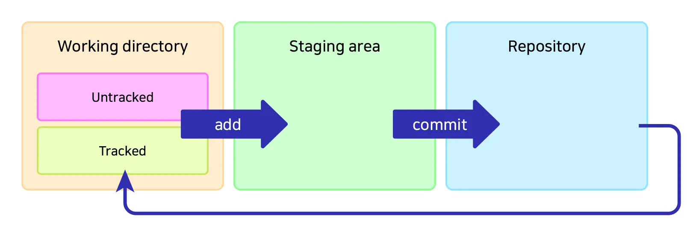
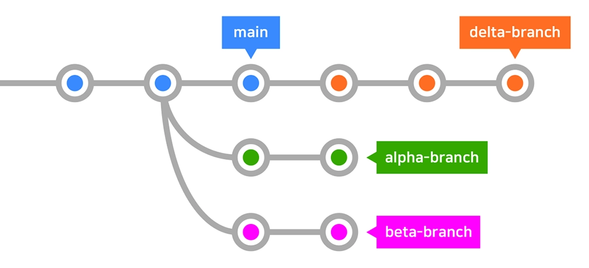

# Git & Github 개인 공부 저장소

## 목차

- [과거로 돌아가는 세 가지 방법](#과거로-돌아가는-세-가지-방법)
  - [reset](#1-reset)
  - [revert](#2-revert)
  - [checkout](#3-checkout)
- [차원 넘나들기 (Branch)](#차원-넘나들기-branch)
  - [브랜치 생성, 삭제, 이름 변경](#1-브랜치-생성-삭제-이름-변경)
  - [브랜치 병합](#2-브랜치-병합)
  - [충돌 해결 및 중단](#3-충돌-해결-및-중단)
- [Github 사용하기](#github-사용하기)
  - [원격 저장소 사용하기 (remote)](#1-원격-저장소-사용하기-remote)
  - [push와 pull](#2-push와-pull)
  - [원격의 브랜치 다루기](#3-원격의-브랜치-다루기)
- [Git의 내부 구조 더 알아보기](#git의-내부-구조-더-알아보기)
  - [Git의 3가지 공간](#1-git의-3가지-공간)
  - [HEAD](#2-head)
  - [fetch vs pull](#3-fetch-vs-pull)
- [Git 심화](#git-심화)
  - [Stash](#1-stash)
  - [마지막 커밋 수정하기](#2-마지막-커밋-수정하기)
  - [과거의 커밋들을 수정, 삭제, 병합, 분할하기](#3-과거의-커밋들을-수정-삭제-병합-분할하기)

---

## 과거로 돌아가는 세 가지 방법

### 1. reset

특정 커밋 시점으로 되돌리며, **그 이후의 커밋 이력을 제거**한다.

```bash
# --soft: 커밋만 되돌리고, 변경사항은 staging area에 유지
git reset --soft <커밋해시>

# --mixed (기본값): 커밋을 되돌리고, 변경사항은 working directory에 유지
git reset --mixed <커밋해시>
git reset <커밋해시>

# --hard: 커밋을 되돌리고, 변경사항도 모두 삭제
git reset --hard <커밋해시>
```

| 옵션      | 커밋   | staging area | working directory |
| --------- | ------ | ------------ | ----------------- |
| `--soft`  | 되돌림 | 유지         | 유지              |
| `--mixed` | 되돌림 | 되돌림       | 유지              |
| `--hard`  | 되돌림 | 되돌림       | 되돌림            |

> **주의:** `--hard`는 변경사항이 완전히 사라지므로 신중하게 사용해야 한다.

---

### 2. revert

특정 커밋의 변경사항을 **취소하는 새로운 커밋**을 만든다. 기존 이력이 보존된다.

```bash
# 특정 커밋을 되돌리는 새 커밋 생성
git revert <커밋해시>

# 커밋 메시지 편집 없이 바로 revert
git revert --no-edit <커밋해시>

# revert 결과를 커밋하지 않고 staging area에만 반영
git revert --no-commit <커밋해시>
```

> **팁:** 이미 원격 저장소에 push한 커밋을 되돌릴 때는 `reset` 대신 `revert`를 사용하는 것이 안전하다.

---

### 3. checkout

특정 커밋 시점의 상태를 **임시로 확인**하거나, 특정 파일을 되돌린다.

```bash
# 특정 커밋 시점으로 이동 (Detached HEAD 상태)
git checkout <커밋해시>

# 원래 브랜치로 돌아오기
git checkout <브랜치명>

# 특정 파일만 해당 커밋 시점으로 되돌리기
git checkout <커밋해시> -- <파일경로>

# 작업 중인 파일의 변경사항 취소 (마지막 커밋 상태로 복원)
git checkout -- <파일경로>
```

> **참고:** Git 2.23 이후부터는 `checkout`의 역할이 `switch`(브랜치 전환)와 `restore`(파일 복원)로 분리되었다.
>
> ```bash
> git switch <브랜치명>       # 브랜치 전환
> git restore <파일경로>      # 파일 복원
> ```

## 차원 넘나들기 (Branch)

### 1. 브랜치 생성, 삭제, 이름 변경

```bash
# 브랜치 목록 확인
git branch

# 새 브랜치 생성
git branch <브랜치명>

# 브랜치 생성과 동시에 이동
git switch -c <브랜치명>

# 브랜치 이름 변경
git branch -m <기존이름> <새이름>

# 브랜치 삭제 (병합된 브랜치만 삭제 가능)
git branch -d <브랜치명>

# 브랜치 강제 삭제 (병합되지 않은 브랜치도 삭제)
git branch -D <브랜치명>
```

> **참고:** `-d`는 병합되지 않은 브랜치를 삭제하려 하면 경고가 뜬다. 정말 삭제하려면 `-D`를 사용한다.

---

### 2. 브랜치 병합

#### merge

두 브랜치의 변경사항을 **병합 커밋**을 만들어 합친다.

```bash
# main 브랜치에서 feature 브랜치를 병합
git switch main
git merge <브랜치명>
```

- 병합 이력이 커밋으로 남아 히스토리를 추적하기 쉽다.
- Fast-forward가 가능하면 별도의 병합 커밋 없이 포인터만 이동한다.

#### rebase

현재 브랜치의 커밋들을 **대상 브랜치 끝으로 재배치**한다.

```bash
# feature 브랜치에서 main을 기준으로 rebase
git switch <브랜치명>
git rebase main
```

- 커밋 히스토리가 깔끔한 직선으로 정리된다.
- 이미 원격에 push한 커밋은 rebase하지 않는 것이 원칙이다.

| 항목      | merge                    | rebase                   |
| --------- | ------------------------ | ------------------------ |
| 히스토리  | 병합 커밋이 남음         | 직선으로 깔끔하게 정리   |
| 기존 커밋 | 변경 없음                | 커밋 해시가 변경됨       |
| 사용 시점 | 협업 브랜치, 공개 브랜치 | 개인 작업 브랜치 정리 시 |

---

### 3. 충돌 해결 및 중단

브랜치 병합 시 같은 파일의 같은 부분을 다르게 수정했다면 **충돌(conflict)**이 발생한다.

#### 충돌 발생 시 파일 형태

```
<<<<<<< HEAD
현재 브랜치의 내용
=======
병합 대상 브랜치의 내용
>>>>>>> <브랜치명>
```

#### merge 충돌 해결

```bash
# 1. 충돌 파일을 열어 원하는 내용으로 수정
# 2. 수정 완료 후 staging
git add <충돌파일>

# 3. 병합 커밋 생성
git commit
```

#### rebase 충돌 해결

```bash
# 1. 충돌 파일을 열어 원하는 내용으로 수정
# 2. 수정 완료 후 staging
git add <충돌파일>

# 3. rebase 계속 진행
git rebase --continue
```

> rebase는 커밋 단위로 재배치하므로, 여러 커밋에서 충돌이 발생하면 각 커밋마다 충돌을 해결해야 한다.

#### 병합 중단

충돌 해결이 어렵거나 병합을 취소하고 싶을 때 사용한다.

```bash
# merge 중단 (병합 이전 상태로 복원)
git merge --abort

# rebase 중단 (rebase 이전 상태로 복원)
git rebase --abort
```

## Github 사용하기

### 1. 원격 저장소 사용하기 (remote)

```bash
# 원격 저장소 목록 확인
git remote

# 원격 저장소 상세 정보 확인 (URL 포함)
git remote -v

# 원격 저장소 추가
git remote add <원격이름> <저장소URL>

# 원격 저장소 이름 변경
git remote rename <기존이름> <새이름>

# 원격 저장소 제거
git remote remove <원격이름>
```

> **참고:** 기본 원격 저장소 이름은 관례적으로 `origin`을 사용한다.

---

### 2. push와 pull

#### 기본 사용법

```bash
# 로컬 커밋을 원격 저장소에 업로드
git push

# 원격 저장소의 변경사항을 로컬로 가져와 병합
git pull
```

#### pull 할 것이 있을 때 pull 하는 두 가지 방법

원격에 새로운 커밋이 있고, 로컬에도 새로운 커밋이 있을 때 pull 방식을 선택할 수 있다.

```bash
# merge 방식 (기본값): 병합 커밋을 생성
git pull --no-rebase

# rebase 방식: 로컬 커밋을 원격 커밋 뒤로 재배치
git pull --rebase
```

| 방식              | 특징                               |
| ----------------- | ---------------------------------- |
| `--no-rebase`     | 병합 커밋이 남아 이력이 보존됨     |
| `--rebase`        | 히스토리가 깔끔한 직선으로 정리됨  |

#### pull 할 때 충돌 해결

pull 시 같은 파일의 같은 부분을 수정했다면 충돌이 발생한다.

```bash
# merge 방식에서 충돌 해결
# 1. 충돌 파일을 열어 원하는 내용으로 수정
# 2. 수정 완료 후 staging & 커밋
git add <충돌파일>
git commit

# rebase 방식에서 충돌 해결
# 1. 충돌 파일을 열어 원하는 내용으로 수정
# 2. 수정 완료 후 staging & rebase 계속
git add <충돌파일>
git rebase --continue
```

#### 로컬의 내역 강제 push

```bash
# 로컬의 이력을 원격에 강제로 덮어씌우기
git push --force
```

> **주의:** `--force`는 원격의 커밋을 덮어쓰므로 협업 시 다른 사람의 작업을 날릴 수 있다. 신중하게 사용해야 한다.

---

### 3. 원격의 브랜치 다루기

```bash
# 원격 브랜치 명시 및 추적 설정 (-u: --set-upstream)
git push -u origin <브랜치명>
```

> 최초 push 시 `-u` 옵션을 사용하면 이후 `git push`, `git pull`만으로 해당 원격 브랜치와 연동된다.

```bash
# 로컬 + 원격 브랜치 목록 전체 확인
git branch --all
git branch -a

# 원격의 브랜치를 로컬에 받아와서 전환 (-t: --track)
git switch -t origin/<브랜치명>

# 원격의 브랜치 삭제
git push <원격이름> --delete <브랜치명>
```

## Git의 내부 구조 더 알아보기

### 1. Git의 3가지 공간

Git은 파일을 **3가지 공간**으로 관리한다.



| 공간                          | 설명                                                    |
| ----------------------------- | ------------------------------------------------------- |
| **Working directory** (작업 디렉터리) | 실제 파일을 수정하는 공간. Untracked 파일과 Tracked 파일이 존재한다. |
| **Staging area** (스테이징 영역)      | `git add`로 커밋할 준비가 된 변경사항이 올라가는 공간               |
| **Repository** (저장소)               | `git commit`으로 확정된 커밋 이력이 저장되는 공간 (`.git` 디렉터리)  |

```
Working directory  --add-->  Staging area  --commit-->  Repository
                   <-----------되돌림(reset 등)-----------
```

- **Untracked**: Git이 아직 추적하지 않는 새 파일
- **Tracked**: Git이 관리하고 있는 파일 (수정됨, 스테이징됨, 커밋됨 등)

---

### 2. HEAD

**HEAD**는 현재 작업 중인 브랜치의 **최신 커밋**을 가리키는 포인터이다.



위 그림처럼 각 브랜치(main, delta-branch, alpha-branch, beta-branch)는 자신만의 최신 커밋을 가리키며, HEAD는 현재 체크아웃된 브랜치의 끝을 가리킨다.

#### checkout으로 HEAD 이동하기

```bash
# 한 커밋 이전으로 이동
git checkout HEAD^

# 세 커밋 이전으로 이동
git checkout HEAD~3
```

- `^`: 한 단계 이전 커밋
- `~N`: N단계 이전 커밋

#### HEAD를 사용하여 reset 하기

```bash
# 한 커밋 전으로 reset (변경사항은 staging area에 유지)
git reset --soft HEAD^

# 한 커밋 전으로 reset (변경사항은 working directory에 유지)
git reset --mixed HEAD^
git reset HEAD^

# 한 커밋 전으로 reset (변경사항 모두 삭제)
git reset --hard HEAD^
```

#### 한 단계 되돌리기

```bash
# 이전에 있던 브랜치 또는 커밋으로 되돌아가기
git checkout -
```

> `git checkout -`는 직전에 체크아웃했던 위치로 다시 전환한다. 브랜치 간 빠르게 오갈 때 유용하다.

---

### 3. fetch vs pull

#### fetch

원격 저장소의 최신 커밋을 로컬로 **가져오기만** 한다. 현재 작업 중인 파일에는 영향을 주지 않는다.

```bash
# 원격의 최신 정보 가져오기
git fetch

# 특정 원격 저장소만 fetch
git fetch origin
```

> fetch 후에는 원격의 변경사항이 `origin/main` 등의 원격 추적 브랜치에만 반영된다. 로컬 브랜치에 적용하려면 별도로 merge 또는 rebase가 필요하다.

#### pull

원격 저장소의 최신 커밋을 가져와서 **자동으로 병합**까지 수행한다. 즉, `fetch` + `merge`(또는 `rebase`)이다.

```bash
# fetch + merge
git pull

# fetch + rebase
git pull --rebase
```

| 명령어       | 동작                         | 로컬 파일 영향 |
| ------------ | ---------------------------- | -------------- |
| `git fetch`  | 가져오기만                   | 없음           |
| `git pull`   | 가져오기 + 병합(merge/rebase) | 있음           |

#### 원격의 새 브랜치 확인 및 가져오기

원격에 새로운 브랜치가 추가되었을 때, fetch 후 확인하고 가져올 수 있다.

```bash
# 원격 정보 업데이트
git fetch

# 원격 브랜치의 내용을 임시로 확인 (Detached HEAD)
git checkout origin/<브랜치명>

# 원격 브랜치를 로컬에 받아와서 전환
git switch -t origin/<브랜치명>
```

## Git 심화

### 1. Stash

현재 작업 중인 변경사항을 **임시로 저장**하고 워킹 디렉터리를 깨끗한 상태로 되돌린다. 브랜치를 전환하거나 다른 작업을 먼저 해야 할 때 유용하다.

```bash
# 현재 변경사항을 스태시에 저장
git stash

# 메시지와 함께 스태시
git stash -m "작업 메시지"

# 원하는 변경사항만 골라서 스태시 (대화형)
git stash -p

# 스태시 목록 보기
git stash list
```

| 명령어                        | 설명                                                |
| ----------------------------- | --------------------------------------------------- |
| `git stash apply`             | 스태시를 적용하되, 목록에서 제거하지 않음            |
| `git stash drop`              | 스태시를 목록에서 제거 (적용하지 않음)               |
| `git stash pop`               | 스태시를 적용하고 목록에서 제거 (`apply` + `drop`)   |
| `git stash branch <브랜치명>` | 새 브랜치를 만들어 스태시를 적용                     |
| `git stash clear`             | 모든 스태시를 삭제                                   |

> **팁:** 번호를 지정하지 않으면 가장 최근 스태시(`stash@{0}`)가 대상이 된다. 특정 스태시를 지정하려면 `git stash apply stash@{2}` 형태로 사용한다.

---

### 2. 마지막 커밋 수정하기

```bash
# 마지막 커밋의 메시지와 내용을 수정 (편집기가 열림)
git commit --amend

# 메시지는 그대로 두고 내용(파일)만 업데이트
git commit --amend --no-edit
```

- 수정할 파일을 `git add`로 스테이징한 뒤 `--amend`하면 마지막 커밋에 반영된다.
- `--no-edit`을 붙이면 커밋 메시지 편집 없이 내용만 갱신한다.

> **주의:** 이미 원격에 push한 커밋을 amend하면 이력이 변경되므로, `--force` push가 필요해진다.

---

### 3. 과거의 커밋들을 수정, 삭제, 병합, 분할하기

`git rebase -i`(interactive rebase)를 사용하면 과거 커밋들을 자유롭게 편집할 수 있다.

```bash
# 대상 커밋의 바로 이전 커밋을 지정
git rebase -i <대상 바로 이전 커밋>
```

편집기가 열리면 각 커밋 앞의 명령어를 변경하여 원하는 작업을 수행한다.

| 명령어   | 약자 | 설명                                       |
| -------- | ---- | ------------------------------------------ |
| `pick`   | `p`  | 커밋을 그대로 사용                         |
| `reword` | `r`  | 커밋 메시지만 수정                         |
| `edit`   | `e`  | 커밋을 수정 (멈춤 후 직접 수정 가능)       |
| `drop`   | `d`  | 커밋을 삭제                                |
| `squash` | `s`  | 이전 커밋과 합치고 메시지를 편집           |
| `fixup`  | `f`  | 이전 커밋과 합치되 메시지는 이전 것을 사용 |

#### 커밋 분할하기

하나의 커밋을 여러 개로 나누고 싶을 때 `edit`을 활용한다.

```bash
# 1. interactive rebase 시작
git rebase -i <대상 바로 이전 커밋>

# 2. 분할할 커밋을 pick → edit(e)으로 변경 후 저장

# 3. 해당 커밋에서 멈추면, 커밋을 되돌리기
git reset HEAD~

# 4. 변경사항을 원하는 단위로 나누어 스테이징 & 커밋
git add <파일1>
git commit -m "첫 번째 분할 커밋"
git add <파일2>
git commit -m "두 번째 분할 커밋"

# 5. rebase 계속 진행
git rebase --continue
```
